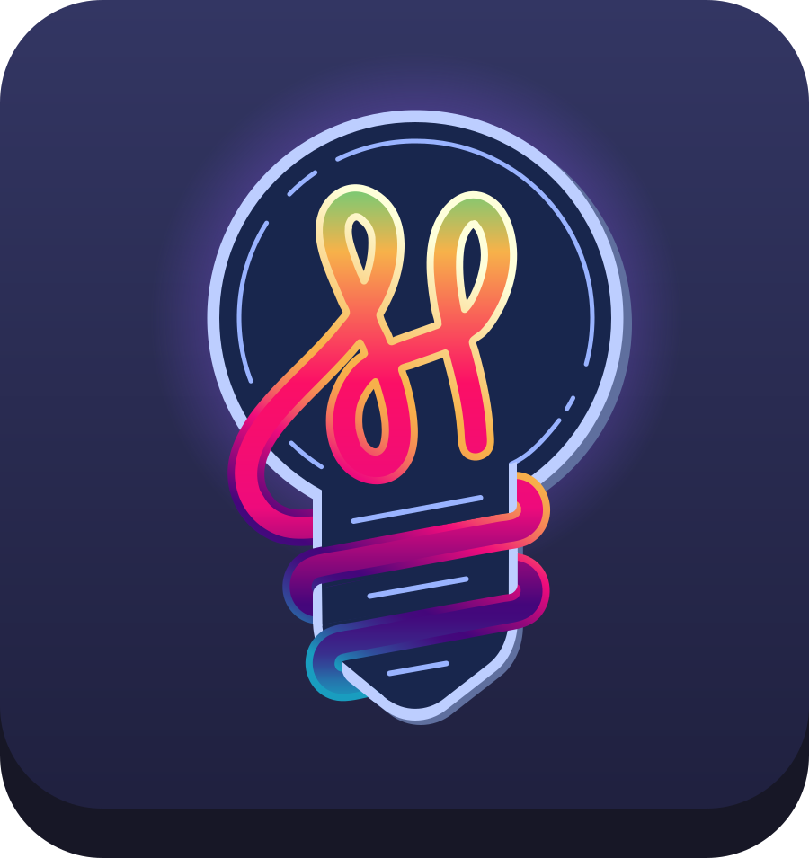

# HUE am I doing?

Enhance your coding experience with a touch of ambiance! When you're in the zone, your surroundings should mirror your mood. Tired of staring at a screen filled with error messages? Immerse yourself in a serene and soothing blue hue. When your code is flowing effortlessly, why not throw a rave party of vibrant colors? And let's not forget those pesky terminal errors—highlight them with a striking red glow.

Introducing the ultimate extension that seamlessly integrates your Visual Studio Code with your Hue lights. With this powerful tool, you can connect multiple bridges and lights, creating a symphony of illumination. But that's not all! Customize your color scheme for each coding activity, allowing you to craft the perfect environment that matches your workflow.

Elevate your coding sessions to new heights, letting your surroundings inspire and motivate you. With this incredible extension, your coding oasis awaits. Embrace the power of visual ambiance and revolutionize the way you code.
